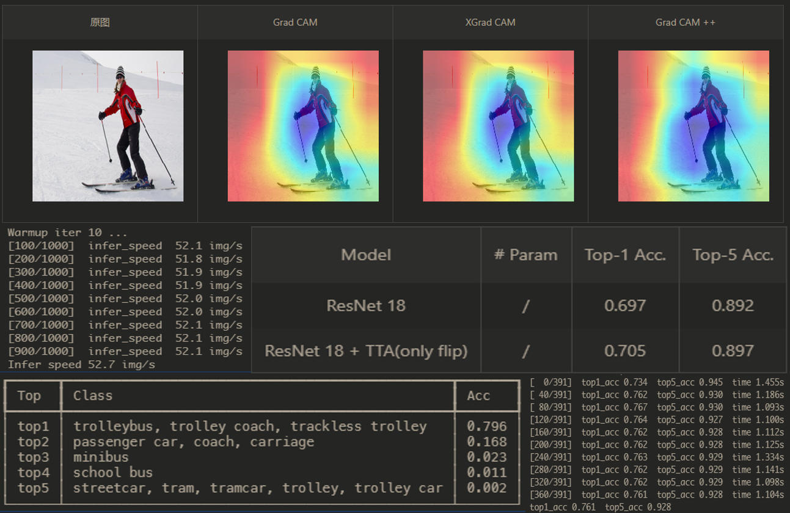

# 📦 Paddle Model Analysis

[](https://www.paddlepaddle.org.cn/) [](https://paddlepaddle.org.cn/documentation/docs/zh/guides/index_cn.html) [](LICENSE) 

这是基于飞桨开发的工具包，以极简主义为特色，用于对分类任务模型进行快速分析🚀🚀🚀

本项目追求最短的代码、更小的冗余，用最小的学习成本让用户使用，以用户体验为根本，在这里你可以用最少三行代码来实现想要的功能。

🎉🎉🎉 十分感谢 PaddlePaddle 公众号推荐本项目 --> [点我查看具体详情](https://mp.weixin.qq.com/s/md0ZvN2M7SLtcwgtEKTe7w)

目前所支持的功能有：

- [x] ImageNet 上快速验证模型
- [x] 测试图片 Top5 类别
- [x] 测试模型 Params、Throughput、FLOPs
- [x] CAM (Class Activation Mapping)
- [ ] Coming Soon ...

🛠犹如瑞士军刀般，小而精悍！

## 更新

Update(2021-12-03)：更新 ImageNet 验证的 `normalize`，统一参数规范

Update(2021-12-03)：TTA(测试时数据增强)不符合PPMA用途，后续版本逐渐废弃，敬请期待下一个工具

Update(2021-11-26)：增加 FLOPs 计算

Update(2021-11-26)：更新 Params、Troughput 的计算

Update(2021-09-29)：优化 ImageNet1k 验证，规范代码为PEP8

## 安装

```bash
pip install ppma
```

## 快速开始

🔥🔥🔥 Note：推荐去 AI Studio 在线免费运行项目 [PPMA 快速指南](https://aistudio.baidu.com/aistudio/projectdetail/2143665)

* ImageNet 上快速验证模型

当训练了新的模型后，或者复现了某个模型，我们需要在 ImageNet 数据集上验证性能，先准备数据集结构如下（可去[ImageNet](https://image-net.org/)官网或者[AI Studio]([https://aistudio.baidu.com/aistudio/datasetdetail/96753)下载）

```bash
data/ILSVRC2012                         # 记住这个路径
	├─ ILSVRC2012_val_00000001.JPEG
	├─ ILSVRC2012_val_00000002.JPEG
	├─ ILSVRC2012_val_00000003.JPEG
	├─ ...
	├─ ILSVRC2012_val_00050000.JPEG
	└─ val.txt                          # target
```

准备好数据集后，运行以下代码

```python
import ppma
import paddle

model = paddle.vision.models.resnet50(pretrained=True)	# 可以替换自己的模型
data_path = "data/ILSVRC2012"	                        # 数据路径

ppma.imagenet.val(model, data_path, batch_size=128 ,img_size=224, crop_pct=0.875, normalize='default')

# normalize='default'   --> mean=(0.485, 0.456, 0.406), std=(0.229, 0.224, 0.225)
# normalize='inception' --> mean=(0.5, 0.5, 0.5), std=(0.5, 0.5, 0.5)
```

* 测试图片 Top5 类别

```python
import ppma
import paddle

img_path = 'test.jpg'                                    # 图片路径
model = paddle.vision.models.resnet50(pretrained=True)   # 可以替换自己的模型

ppma.imagenet.test_img(model, img_path, img_size=224, crop_pct=0.875, normalize='default')
```

* 测试模型 Params、FLOPs、Throughput

```python
import ppma
import paddle

res50 = paddle.vision.models.resnet50()   # 可以替换自己的模型

# FLOPs、Params -- depend model and resolution
ppma.modelstat.flops(model=res50, img_size=224, detail=True)

# Thoughput -- depend model and resolution
ppma.modelstat.throughput(model=res50, img_size=224)
```

* CAM (Class Activation Mapping)

```python
import paddle
import matplotlib.pyplot as plt
from ppma import cam

img_path = 'img1.jpg'                                      # 图片路径
model = paddle.vision.models.resnet18(pretrained=True)     # 模型定义
target_layer = model.layer4[-1]                            # 提取模型某层的激活图
cam_extractor = cam.GradCAMPlusPlus(model, target_layer)   # 支持 GradCAM、XGradCAM、GradCAM++

# 提取激活图
activation_map = cam_extractor(img_path, label=None)   
plt.imshow(activation_map)
plt.axis('off')
plt.show()

# 与原图融合
cam_image = cam.overlay(img_path, activation_map)   
plt.imshow(cam_image)
plt.axis('off')
plt.show()
```

## 设计的哲学

目前有很多优秀的库拥有着简洁易用的体验，比如fastai、keras、scikit-learn，以及飞桨自家的PaddleHapi，这些都是对复杂的代码进行封装，大大降低了用户上手难度以及用户学习成本，同时高度的封装带来的是灵活性、自定义性的下降，如何去权衡这两个矛盾是一个需要思考的问题

* 命名的艺术

对函数的命名是一个需要推敲磨打的技术活，一方面函数命名尽量简单直观，做到用户自然记忆不需要查函数名，这就要求尽量命名短，单词意思尽量贴合使用场景。一方面又要避免与用户变量命名习惯冲突，比如"img"这个命名很常见，大多数用来表示一张图片，故命名函数时尽可能避开它，这能降低因为命名问题造成的error

```python
# 针对 ImageNet 数据集进行验证的函数
# 当前方案
ppma.imagenet.val(model, img_path)     # 简洁优雅

# 曾经方案
ppma.ILSVRC2012.val(model, img_path)         # ILSVRC2012 太长不方便记忆
ppma.imagenet2012.validate(model, img_path)  # 变量命名有些冗余，可以缩短而不影响理解
...
```

* 结构的设计

高度封装以及灵活性是一对矛盾。比如具有高度封装的Keras，其灵活性和自定义性没有Pytorch那么好。在本项目（模型分析）上，因为我们只是针对具体任务进行分析，其自定义性需求并不是那么高，我们可以适当提高封装性，同时支持更多的默认参数，用户可以通过修改默认参数来完成特定需求，比如CAM增加自定义标签（默认是网络输出的标签）查看相应激活图。

```python
# 本项目设计参考 Box 思想，用户只需要准备需要的放入函数里一键运行即可
#
#  model \
#  img   － Box － Result
#  ...   /
```

## 效果预览

 

